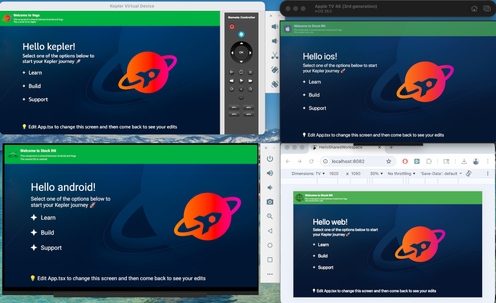

# VegaSharedWorkspacePlayground

A monorepo for building TV apps across Vega (Fire TV) and Expo TV (Android TV / Apple TV / Web) using yarn workspaces.



## Goal

Demonstrate a unified build system where:

- Shared business logic and components live in a common workspace
- Platform-specific apps (Vega and Expo TV) can consume shared code
- Each target maintains its own build pipeline while sharing dependencies

## Project Structure

```
├── package.json                 # Root workspace config (yarn workspaces)
├── packages/
│   ├── shared/                  # @hellosharedworkspace/shared
│   │   ├── index.ts             # Exports shared components and types
│   │   ├── package.json
│   │   └── components/
│   │       └── Banner.tsx       # Reusable banner component
│   ├── expotv/            # mytvproject (Expo TV app)
│   │   ├── assets/
│   │   ├── App.tsx
│   │   ├── app.json
│   │   ├── metro.config.js
│   │   ├── tsconfig.json
│   │   └── package.json
│   └── vega/                    # @hellosharedworkspace/vega
│       ├── src/
│       │   ├── assets/
│       │   ├── components/
│       │   └── App.tsx
│       ├── test/
│       ├── manifest.toml
│       ├── metro.config.js
│       ├── tsconfig.json
│       └── package.json
```

## Requirements

- **Node.js**: 20+
- **Yarn**: 4.x
- **tvOS**: 26+ (for Apple TV development)
- **Android TV**: API Level 34+ (Android 14+)
- For Vega: Kepler CLI and development environment
- For ExpoTV: 
  - Android Studio with Android TV system image (for Android TV)
  - Xcode (for Apple TV)


| Workspace       | Package Name                   | Purpose                                          |
| --------------- | ------------------------------ | ------------------------------------------------ |
| `shared`        | `@hellosharedworkspace/shared` | Shared components and logic                      |
| `expotv`       | `mytvproject`                  | Android TV / Apple TV (Expo + react-native-tvos) |
| `vega`          | `@hellosharedworkspace/vega`   | Fire TV (Kepler)                                 |

## Quick Start

```bash
# Install all workspace dependencies
yarn

# Build Vega/Fire TV app (debug)
yarn vega:build

# Run Expo TV prebuild
yarn expotv:prebuild

# Run Android TV app
yarn expotv:android

# Run Apple TV app
yarn expotv:ios

# Clean all workspaces
yarn clean
```

## Commands

| Command                | Description                                |
| ---------------------- | ------------------------------------------ |
| `yarn vega:build`      | Build Vega/Fire TV app (debug)             |
| `yarn expotv:prebuild` | Generate native projects for Expo TV       |
| `yarn expotv:android`  | Run Android TV app                         |
| `yarn expotv:ios`      | Run Apple TV app                           |
| `yarn clean`           | Clean all workspaces and root node_modules |

## Tech Stack

### Expo TV App (expotv)

- **Expo SDK 54** (^54.0.20)
- **React 19.1.0**
- **react-native-tvos 0.81-stable**
- **TypeScript ~5.9.2**
- **@react-native-tvos/config-tv ^0.1.4**

### Fire TV App (vega)

- **Kepler** (@amazon-devices/react-native-kepler ^2.0.0)
- **React 18.2.0**
- **React Native 0.72.0**
- **TypeScript 4.8.4**
- **Jest** for testing with snapshot support

### Shared Workspace

- **TypeScript**
- Shared components:
  - **Banner**: Reusable banner component with title, subtitle, optional press handler, and TV-optimized focus handling
- Platform-agnostic business logic
- Exports components and TypeScript types

## Key Features

- **Workspace Isolation**: Each app maintains its own React Native and React versions without conflicts
- **Shared Components**: Common UI components in the `shared` workspace
  - `Banner` component: A reusable, customizable banner with TV focus support, press handlers, and TypeScript types
  - Exported via `@hellosharedworkspace/shared` for use in both Android TV and Fire TV apps
- **Nohoist Configuration**: Critical packages are excluded from hoisting to avoid version conflicts
- **Testing**: Vega workspace includes Jest setup with snapshot testing
- **Multiple Build Targets**: Expo TV supports Android TV and Apple TV

## Development Notes

- The Expo TV app uses React 19.1.0 with Expo SDK 54
- The Fire TV app uses React 18.2.0 with React Native 0.72.0 for Kepler compatibility
- Both apps can consume shared code from the `@hellosharedworkspace/shared` workspace
